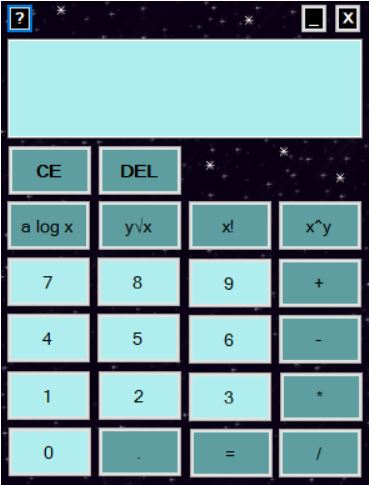

    <h1>Star calculator</h1>
    

    
     
    

# VUT FIT - IVS projekt 2
Tímový projekt

## Prostredie
Windows 64bit

## Názov tímu
!Name

## Autori
- xcubin00 Pavol Cubinek
- xradac00 Karolína Radačovská
- xsnase07 Iveta Snášelová

## Popis projektu
Jednoduchá kalkulačka s inštalátorom, manuálom aj dokumentáciou
\+ samostatne profiling.

## Inštalácia
Ku kalkulačke je vytvorený klasický windows installer. 
Podrobný popis a návod na inštaláciu nájdete v [manuáli](https://gitlab.com/karolina_radacovska/ivs_project_2_notname/-/blob/repository/dokumentace.pdf) na strane štyri.

## Licencia
Tento program je poskytovaný [GNU General Public License v3.0](https://gitlab.com/karolina_radacovska/ivs_project_2_notname/-/blob/bd7e5c17c4e4228a7e6a848d87d544c6201329d1/LICENSE)
